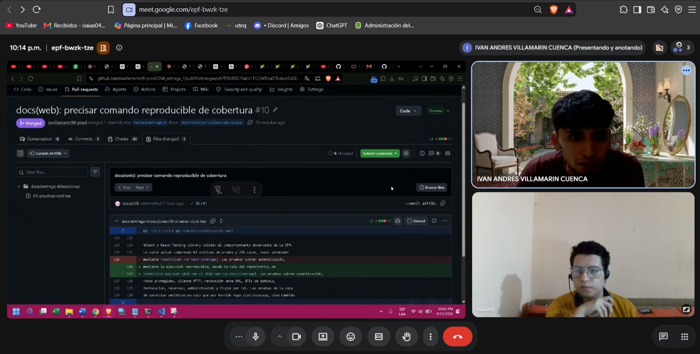
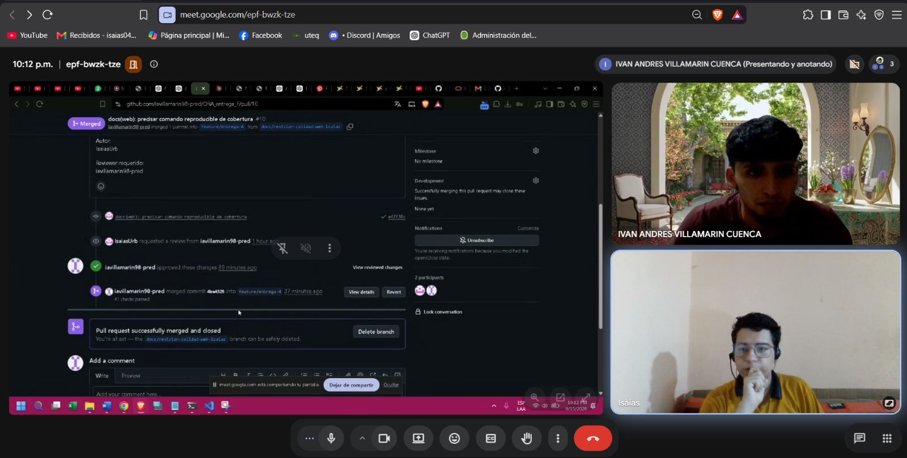

# ACTA-06 — Reunión contemporánea de cierre y revisión del PFC

**Fecha:** 15/09/2026

**Hora de inicio:** 21:58

**Hora de fin:** 22:45

**Zona horaria:** UTC-05:00

**Medio:** Google Meet

## Participantes

- Isaías Urbina
  - GitHub: `IsaiasUrb`
  - Rol: desarrollo, revisión de avances y corrección de observaciones.
- Iván Villamarín
  - GitHub: `iavillamarin98-pred`
  - Rol: revisión de cambios, validación de evidencias y observaciones sobre las correcciones.

## Objetivo

Revisar el cierre del punto #7 de la guía del PFC, validar la revisión cruzada realizada en el PR #10 del repositorio histórico y organizar el tratamiento de los puntos pendientes.

## Temas tratados

### 1. Punto #7 — Calidad Web

Se revisaron los siguientes resultados de las pruebas de la aplicación Web:

- 43 archivos de prueba.
- 296 pruebas aprobadas.
- Statements: 81.89 %.
- Branches: 70.25 %.
- Functions: 78.43 %.
- Lines: 84.87 %.

La revisión abarcó los porcentajes de cobertura y la reproducibilidad de los resultados. Se revisó el procedimiento para reproducir la medición desde la raíz del repositorio:

```bash
cd apps/web && npm ci && npm run test:coverage
```

**Estado acordado:** punto #7 cerrado con base en la evidencia reproducible revisada y su integración mediante los PR correspondientes.

### 2. Revisión cruzada del PR #10 del repositorio histórico

Durante la reunión se revisó el PR #10 del repositorio histórico
`iavillamarin98-pred/ORA_entrega_F`, utilizado como evidencia verificable
del proceso de revisión seguido por el equipo.

- Repositorio: `iavillamarin98-pred/ORA_entrega_F`.
- PR: #10 — `docs(web): precisar comando reproducible de cobertura`.
- Autor: `IsaiasUrb`.
- Reviewer: `iavillamarin98-pred`.
- Review: `APPROVED`.
- Merge commit: `4ba4325`.
- Rama destino: `feature/entrega-4`.

La revisión fue realizada por Iván Villamarín, una persona distinta al autor
del cambio, Isaías Urbina.

> Nota de trazabilidad: este PR #10 pertenece al repositorio histórico
> `iavillamarin98-pred/ORA_entrega_F` y no debe confundirse con el PR #10
> posterior del repositorio oficial `gleiston-guerrero/Entrega-final-del-PFC`.

Se acordó el siguiente flujo de trabajo:

1. El autor realiza el cambio y abre el PR.
2. El reviewer revisa el diff y las evidencias.
3. Si hay errores, el reviewer deja observaciones.
4. El autor corrige.
5. El reviewer vuelve a comprobar.
6. El merge se realiza solo después de la aprobación.

### 3. Estado general del PFC

- Puntos cerrados: 27/37.
- Punto parcial: #36 — Actas y revisión cruzada.

Puntos pendientes:

- #9 — Cámara / FCM.
- #15 — Pipeline y publicación etiquetada.
- #16 — Observabilidad.
- #17 — Spark / speedup.
- #22 — Bibliografía.
- #26 — LICENSE + CITATION + README.
- #28 — Capturas Web / Mobile.
- #35 — APK firmado / release.
- #37 — Documento único.

### 4. Próximo trabajo

- El siguiente punto específico quedó por definir.
- Responsable: Isaías Urbina o Iván Villamarín.
- Reviewer: el participante que no haga el cambio.
- Rama: específica para el punto.
- Evidencia: código o documentación modificada, pruebas, CI en verde y evidencia requerida por la guía.
- Criterio de cierre: verificable desde el repositorio y con revisión cruzada antes del merge.

## Acuerdos

- Los futuros cambios se realizarán mediante PR con revisión de una persona distinta al autor.
- Las observaciones deben resolverse antes de aprobar.
- Las próximas reuniones también se registrarán de forma contemporánea.

## Decisiones

- Cerrar el punto #7 con la evidencia revisada.
- Mantener la revisión cruzada para los siguientes cambios.

## Riesgos

- Integrar cambios sin review.
- Marcar observaciones como resueltas sin comprobar la corrección.

## Evidencias

La captura `meet-revision-pr10.png` muestra la sesión activa de Google Meet
durante la revisión técnica del PR #10 del repositorio histórico
`iavillamarin98-pred/ORA_entrega_F`.



La captura `pr10-aprobado-mergeado.png` documenta la aprobación de
`iavillamarin98-pred` y la integración del PR #10 del repositorio histórico.



## Cierre

- Hora final: 22:45 (UTC-05:00) del 15/09/2026.
- Isaías Urbina — conforme.
- Iván Villamarín — conforme.
