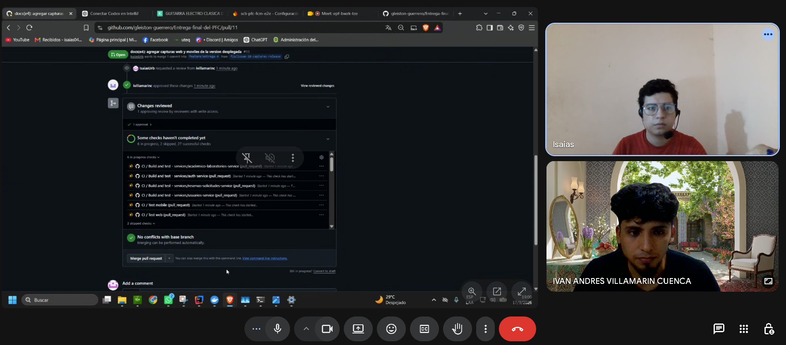
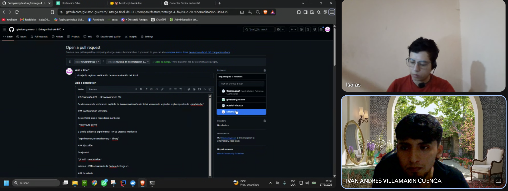
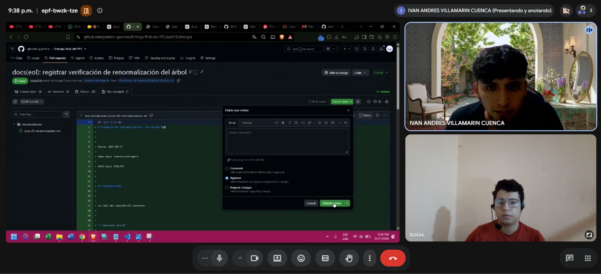

# ACTA-07 — Revisión cruzada de PR del repositorio oficial

**Fecha:** 17/09/2026

**Rango temporal evidenciado por capturas:** 19:00-21:38 UTC-05:00

**Hora formal de inicio/fin:** no se declara; las capturas solo permiten
establecer el rango temporal evidenciado.

**Medio:** Google Meet

## Participantes

- Isaías Urbina
- Iván Villamarín

## Objetivo

Registrar contemporáneamente la revisión cruzada efectuada sobre cambios del
repositorio oficial durante el cierre del PFC.

Las capturas asociadas fueron tomadas durante la sesión del 17/09/2026. Esta
acta documenta únicamente hechos observables en esas evidencias y separa los
hechos del repositorio oficial de la evidencia histórica descrita en ACTA-06.

## Revisión cruzada del PR #11

Durante la sesión se revisó el PR #11 del repositorio oficial
`gleiston-guerrero/Entrega-final-del-PFC`.

- PR: #11 — `docs(e4): agregar capturas web y moviles de la version desplegada`.
- Autor: `IsaiasUrb`.
- Reviewer: `ivillamarinc`.
- Estado de revisión visible en la evidencia: `APPROVED`.
- Autor y reviewer corresponden a integrantes distintos.
- GitHub mostraba ausencia de conflictos con la rama base.
- En el instante de la captura todavía existían verificaciones automáticas en
  ejecución.

Esta evidencia demuestra la aplicación efectiva del proceso de revisión cruzada
requerido para las solicitudes de incorporación. La captura no se interpreta
como evidencia de que todos los checks hubieran terminado, porque algunos
seguían en ejecución.

## Proceso de revisión del PR #12

Durante la misma sesión se inició y revisó el PR #12 correspondiente a la
corrección #20.

- Repositorio: `gleiston-guerrero/Entrega-final-del-PFC`.
- Rama base: `feature/entrega-4`.
- Rama de comparación: `fix/issue-20-renormalizacion-isaias-v2`.

La evidencia registra:

- creación del PR hacia `feature/entrega-4`;
- selección de un reviewer distinto al autor;
- inspección del cambio documental sobre la renormalización;
- preparación de una revisión con la opción `Approve` seleccionada.

La captura documenta el proceso de revisión en curso. No se utiliza por sí sola
para afirmar que la aprobación ya había sido enviada, porque el botón `Submit
review` todavía está visible.

### Resultado final verificable del PR #12

Posteriormente, GitHub registró la revisión del PR #12 como `APPROVED`
por `ivillamarinc`, un integrante distinto del autor `IsaiasUrb`.

El PR fue integrado a `feature/entrega-4` mediante el merge commit:

`29ee3d8`

Esta información corresponde al estado final verificable del PR en GitHub
y se distingue de la captura tomada durante la sesión, donde la opción
`Approve` todavía estaba seleccionada antes de enviar la revisión.

## Alcance probatorio

- ACTA-06 corresponde a una reunión contemporánea del 15/09/2026 y contiene
  evidencia del PR #10 del repositorio histórico
  `iavillamarin98-pred/ORA_entrega_F`.
- ACTA-07 corresponde a una reunión contemporánea del 17/09/2026 y contiene
  evidencia de la revisión del PR #11 y del proceso de creación y revisión del
  PR #12 del repositorio oficial `gleiston-guerrero/Entrega-final-del-PFC`.
- La evidencia histórica de ACTA-06 no se presenta como evidencia del
  repositorio oficial actual.
- Una captura con la opción `Approve` seleccionada no equivale a un estado
  `APPROVED` ya registrado.

## Evidencias

### Formato de evidencias

La evidencia `pr12-creacion-reviewer.png` conserva su nombre historico, pero sus
magic bytes corresponden a contenido JPEG. No se renombra ni se convierte en
esta correccion para no alterar bytes ni romper trazabilidad; una correccion de
formato posterior deberia renombrar el archivo y actualizar todas sus
referencias de forma coordinada.

### PR #11

La captura `pr11-aprobado-repo-oficial.png` documenta la revisión cruzada
realizada sobre el PR #11 del repositorio oficial. `IsaiasUrb` solicitó la
revisión y `ivillamarinc` aprobó los cambios. En el instante de la captura
todavía existían verificaciones automáticas en ejecución.

### Creación del PR #12

La captura `meet-revision-pr12.png` documenta la preparacion del PR
correspondiente a la correccion #20, con `feature/entrega-4` como rama base y
la seleccion de Ivan como reviewer. Aunque el nombre del archivo alude a Meet,
la pantalla visible corresponde al formulario `Open a pull request`.

### Revisión del PR #12 durante la sesión

La captura `pr12-creacion-reviewer.png` documenta la sesion de Google Meet a
las 21:38 mientras se revisaba el PR #12. En la interfaz de GitHub se observa
el formulario `Finish your review` con la opcion `Approve` seleccionada antes
de enviar la revision. Aunque el nombre del archivo alude a creacion/reviewer,
la pantalla visible corresponde a la preparacion de la aprobacion.

