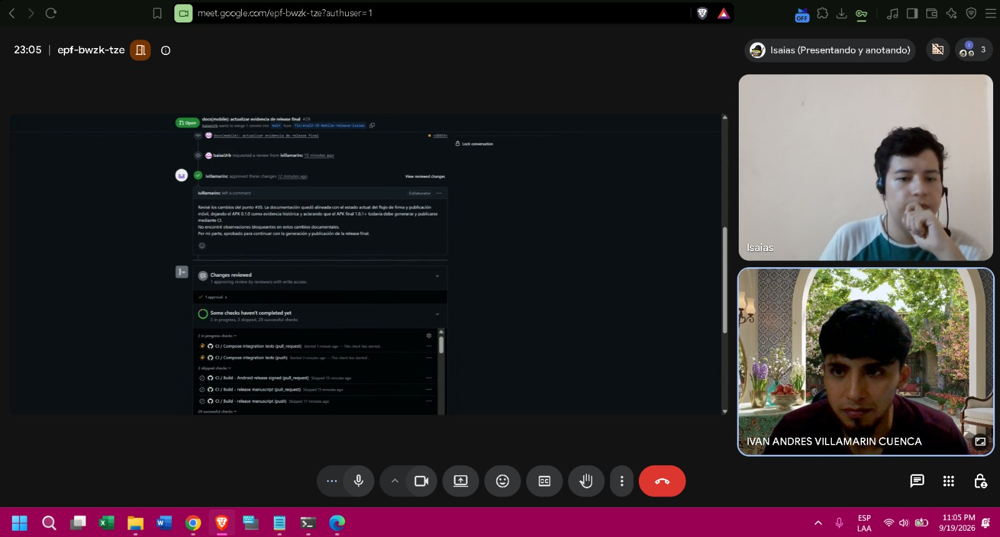
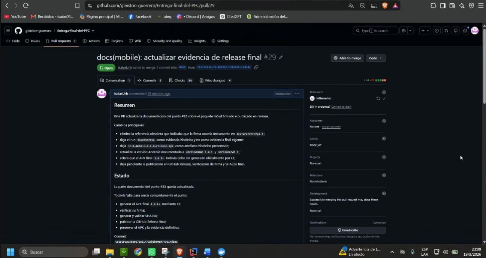
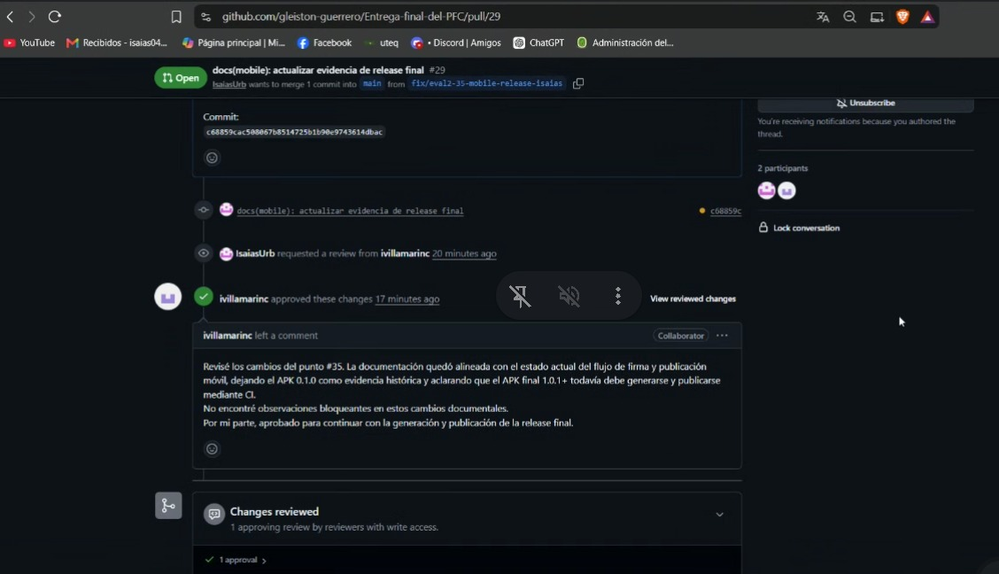
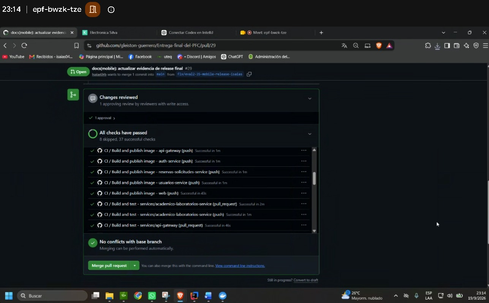
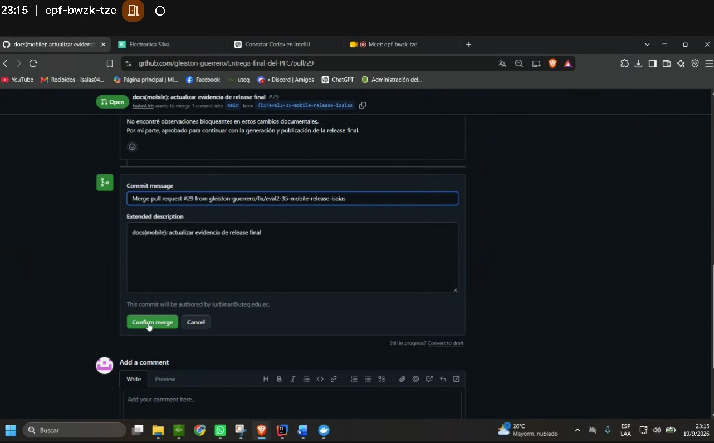
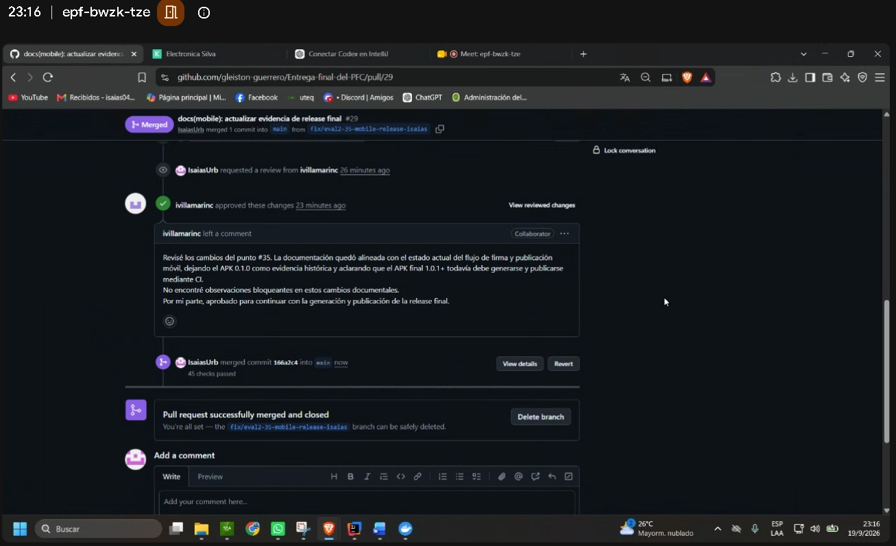

# ACTA-08 - Revision cruzada del PR #29 para evidencia de release final

**Fecha:** 19/09/2026

**Hora de inicio:** Primera evidencia temporal disponible: 23:05.

**Ultima evidencia temporal disponible:** 23:16

**Zona horaria:** UTC-05:00

**Medio:** Google Meet y GitHub

## Participantes

- Isaias Urbina
  - GitHub: `IsaiasUrb`
  - Rol verificable: autor del PR #29 y presentador en la sesion de Google Meet.
- Ivan Andres Villamarin Cuenca
  - GitHub: `ivillamarinc`
  - Rol verificable: reviewer del PR #29.

Nota objetiva: la evidencia de Google Meet muestra 3 participantes conectados,
pero solo permite identificar nominalmente a Isaias e Ivan. No se atribuye
identidad al tercer participante por falta de evidencia suficiente.

## Objetivo

Registrar contemporaneamente la verificacion del estado del PR #29 del
repositorio oficial para el punto #36, usando las evidencias disponibles de la
sesion y del flujo de revision en GitHub, sin presentar como realizadas durante
la reunion acciones ocurridas antes de la primera evidencia temporal disponible.

## PR revisado

- Repositorio: `gleiston-guerrero/Entrega-final-del-PFC`.
- PR: #29 - `docs(mobile): actualizar evidencia de release final`.
- Autor: `IsaiasUrb`.
- Reviewer: `ivillamarinc`.
- Rama base visible: `main`.
- Rama de comparacion visible: `fix/eval2-35-mobile-release-isaias`.

## Cronologia verificable

### 23:05

- Meet activo.
- Verificacion del estado del PR #29 durante la reunion.
- La evidencia muestra el PR #29 abierto y la conversacion de revision visible.
- En la sesion se identifican nominalmente Isaias e Ivan; tambien se observa un
  total de 3 participantes conectados, sin identidad suficiente para el tercero.

### 23:14

- Los checks aparecen en estado satisfactorio.
- El PR #29 continua abierto.
- La pantalla muestra ausencia de conflictos con la rama base y disponibilidad
  de la accion de merge.

### 23:15

- Pantalla de confirmacion del merge del PR #29.
- El mensaje de merge visible corresponde al PR #29 desde
  `fix/eval2-35-mobile-release-isaias`.

### 23:16

- El PR #29 aparece fusionado a `main`.
- La evidencia muestra el PR fusionado y cerrado.

## Revision

La evidencia muestra que `ivillamarinc` realizo la revision del PR #29, dejo un
comentario escrito y aprobo los cambios antes del merge.

Salvedad cronologica: la aprobacion del PR #29 por `ivillamarinc` ocurrio antes
del inicio de la ventana documentada de esta reunion. Durante la reunion se
verificaron el estado del PR, los checks disponibles y su posterior fusion. Por
tanto, la aprobacion no se presenta como una accion realizada durante la
reunion.

Comentario visible del reviewer:

> Reviso los cambios del punto #35. La documentacion quedo alineada con el
> estado actual del flujo de firma y publicacion movil, dejando el APK 0.1.0
> como evidencia historica y aclarando que el APK final 1.0.1+ todavia debe
> generarse y publicarse mediante CI. No encontre observaciones bloqueantes en
> estos cambios documentales. Por mi parte, aprobado para continuar con la
> generacion y publicacion de la release final.

No se registra `REQUEST_CHANGES` en la evidencia disponible. Tampoco se afirman
correcciones posteriores no documentadas por las capturas.

## Alcance probatorio

- Esta acta usa unicamente las capturas disponibles para el PR #29.
- La hora de inicio de la reunion no se infiere: se consigna la primera
  evidencia temporal disponible.
- La participacion del tercer conectado en Meet no se identifica nominalmente.

## Evidencias

La captura `acta-08-meet-revision-pr29-2305.png` muestra la sesion activa de
Google Meet a las 23:05 durante la revision del PR #29.

La captura `acta-08-pr29-abierto.png` muestra el PR #29 abierto en el
repositorio oficial.

La captura `acta-08-pr29-review-aprobacion-ivan.png` muestra la revision de
`ivillamarinc`, su comentario escrito y la aprobacion de los cambios.

La captura `acta-08-pr29-checks-aprobados-2314.png` muestra los checks en estado
satisfactorio a las 23:14, con el PR todavia abierto.

La captura `acta-08-pr29-confirmacion-merge-2315.png` muestra la pantalla de
confirmacion del merge a las 23:15.

La captura `acta-08-pr29-merge-completado-2316.png` muestra el PR #29 fusionado
a `main` y cerrado a las 23:16.

## Cierre

- Primera evidencia temporal disponible: 23:05.
- Ultima evidencia temporal disponible: 23:16.
- Estado final verificable: PR #29 fusionado a `main`.
